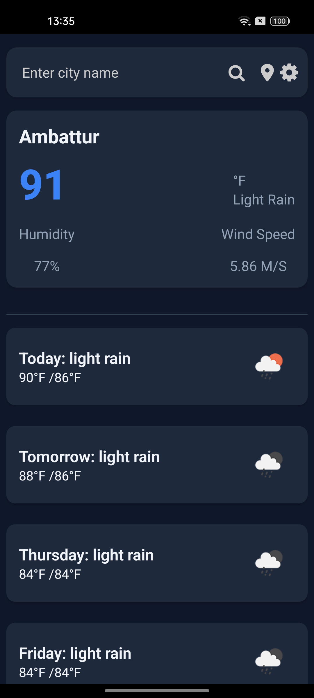
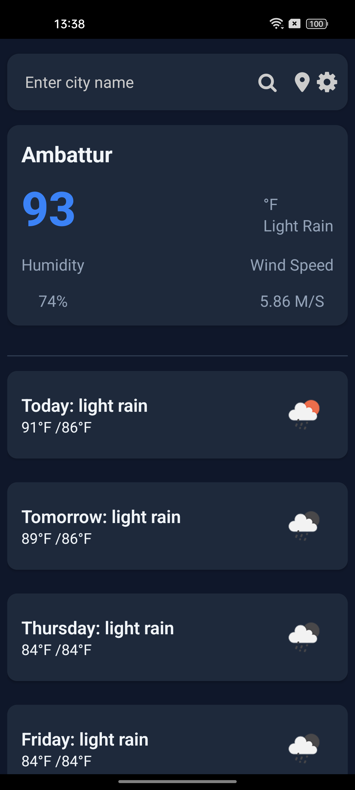
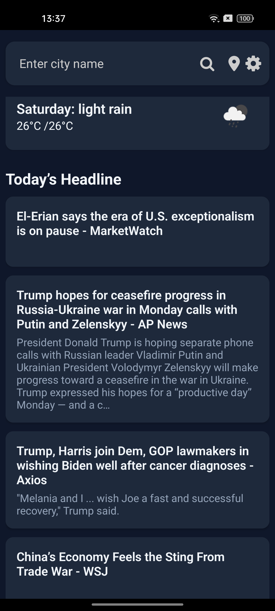
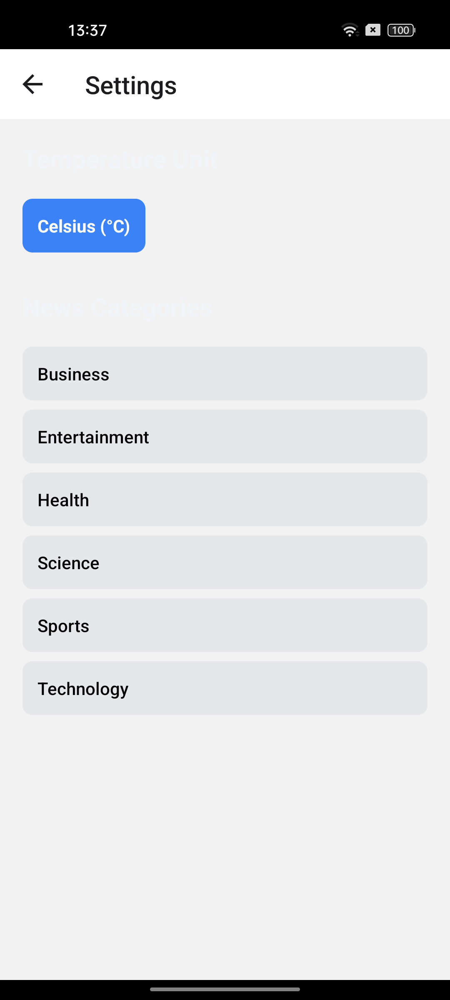
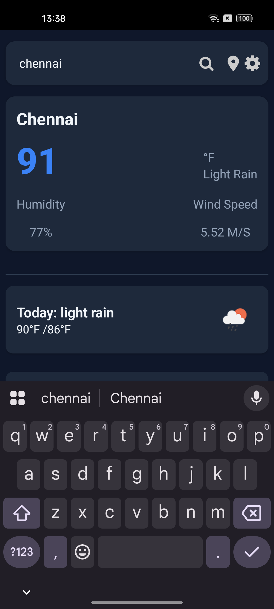

# Weather & News React Native App

A React Native application that shows weather forecasts and news headlines based on the searched city or the user's current location. It uses the OpenWeatherMap API for weather data and a news API for news articles.

---

## Features

- Search weather by city name.
- Get weather and news based on current GPS location.
- Display current weather and 5-day forecast.
- Show news headlines related to weather conditions.
- Responsive UI with loading and error handling.

---

## Screenshots

Here are some screenshots demonstrating the app UI:

| Home Screen          | Weather Forecast       | News Headlines        | Settings Screen       | Search Screen         |
|----------------------|------------------------|------------------------|------------------------|------------------------|
|  |  |  |  |  |

> **Note:** Make sure your screenshots are placed in the `screenshots/` folder at the root level.

---

## Getting Started

### Prerequisites

- Node.js & npm or yarn
- React Native CLI
- Android Studio or Xcode for simulators
- API keys:
  - OpenWeatherMap: https://openweathermap.org/api
  - News API (e.g. NewsAPI.org)

### Installation

1. Clone the repository:

```bash
git clone https://github.com/yourusername/weather-news-app.git
cd weather-news-app
